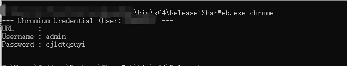
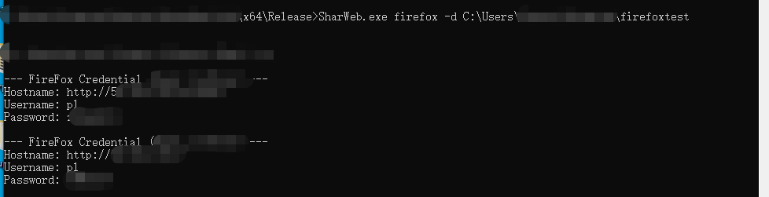

# sharweb
## 介绍

渗透测试中常见浏览器(firefox内核以及chrome内核)解密工具

本项目在[SharpWeb](https://github.com/djhohnstein/SharpWeb)基础上添加了高版本firefox以及chrome的解密以及指定目录解密，使用`-d`参数可以指定浏览器目录进行解密

## Usage

```
Usage:
    .\SharWeb.exe arg0 [arg1 arg2 ...]

Arguments:
    all       - Retrieve all Chrome, FireFox and IE/Edge credentials.
    full      - The same as 'all'
    chrome    - Fetch saved Chrome logins.e.g -d Directory
    firefox   - Fetch saved FireFox logins.e.g: -p masterkey -d Directory.
    edge      - Fetch saved Internet Explorer/Microsoft Edge logins.
```

## 用例:

```
.\SharWeb.exe chrome
```




```
sharWeb.exe firefox -d C:\xxxx
```



## 参考致谢

https://github.com/djhohnstein/SharpWeb

https://github.com/lclevy/firepwd/blob/master/firepwd.py

https://github.com/djhohnstein/SharpChromium
